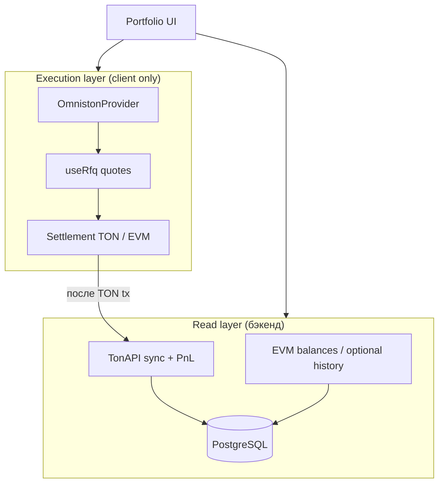

# Кросс-чейн портфолио + Omniston: идея и план реализации

> План интеграции `@ston-fi/omniston-sdk-react` в TON Wallet Analytics.  
> Документ описывает продуктовую идею, архитектуру и поэтапную реализацию **без кода**.

**Связанные документы:** [project-overview.md](./project-overview.md) · [omniston-sdk](https://github.com/ston-fi/omniston-sdk) · [Omniston docs](https://docs.ston.fi/developer-section/omniston)

---

## Продуктовая идея (зачем это пользователю)

**Сейчас:** «вбил TON-адрес → увидел PnL и историю» (read-only аналитика).

**Цель:** «собрал портфель из кошельков в разных сетях → вижу единую картину → из строки любого актива делаю cross-chain swap».

Ценность в связке **analytics + action**, а не в клоне [omniston.ston.fi](https://omniston.ston.fi):

| Сценарий | Что даёт продукт |
|----------|------------------|
| Холдер TON-жетона смотрит PnL | Кнопка «Swap out» → USDC на Base/Ethereum без ухода в другой dApp |
| Несколько кошельков (TON + EVM) | Агрегированный net worth + разбивка по сетям |
| После свапа через Omniston | Авто-sync TON-стороны → PnL обновился, свап попал в аналитику |
| Гость без логина | Как сейчас: аналитика по адресу; свапы только после connect |

**Killer UX:** на вкладке **PnL / Tokens** у каждого актива — `Trade` / `Bridge & Swap`, префилл `from`: текущий жетон + сеть + баланс пользователя.

---

## Что даёт Omniston технически

По [докам v1beta8](https://docs.ston.fi/developer-section/omniston/v1beta8):

- **Сети:** TON (`50`), Base (`3`), BNB (`4`), Ethereum (`5`), Polygon (`6`); Arbitrum/Avalanche — planned.
- **Один RFQ-flow** для intrachain TON и cross-chain (HTLC).
- **React SDK** (`@ston-fi/omniston-sdk-react`): хуки поверх WebSocket (`useRfq`, tracking settlement), TanStack Query — в проекте уже есть.
- **Кошельки:** TON Connect (есть) + **EVM** через Reown AppKit + wagmi/viem (как в [example app](https://github.com/ston-fi/omniston-sdk/tree/main/examples/react-app)).

> ⚠️ SDK **0.x** — пинить точную версию в `package.json`. Финансовый риск: баги = потеря средств; тест только sandbox + мелкие суммы.

---

## Архитектурный принцип: два слоя



- **Аналитика** — server/RSC + Prisma (как сейчас).
- **Свапы** — только `'use client'`, без секретов на сервере.
- **Не тащить** Omniston в sync pipeline; после успешного swap — триггер `POST /api/sync` для TON-кошелька.

---

## Новый домен: `portfolio` (не ломая `wallet`)

Сейчас: `User.walletAddress` — один TON. Для мульти-кошелька:

```prisma
// концепт, не миграция
model Portfolio {
  id        String   @id
  userId    String
  name      String?
  wallets   PortfolioWallet[]
}

model PortfolioWallet {
  id          String
  portfolioId String
  chain       String   // ton | ethereum | base | bnb | polygon
  address     String   // normalized
  label       String?
  isPrimary   Boolean
  @@unique([portfolioId, chain, address])
}
```

### Маршруты

| Путь | Назначение |
|------|------------|
| `/portfolio` | Список портфелей (auth) |
| `/portfolio/[id]` | Агрегат: балансы, PnL (TON), swap CTA |
| `/wallets/[address]` | Как сейчас (публичная аналитика) |
| `/wallets/[address]?jetton=...&swap=1` | Deep link в swap drawer с префиллом |

Гость: `/wallets/...` без изменений. Портфель — только залогиненным.

---

## Модульная структура (Clean Architecture)

```
src/modules/
  portfolio/          # NEW — агрегация кошельков
    domain/             # PortfolioEntity, ChainId, AssetKey
    application/        # AggregateBalancesUseCase, LinkWalletUseCase
    api/                # /api/portfolio/*
    presentation/       # PortfolioDashboard, WalletLinker

  omniston/             # NEW — только execution UI + адаптеры
    domain/             # omniston-asset.mapper.ts (ChainJetton → AssetId)
    presentation/
      providers/        # OmnistonProviders (TON + EVM)
      components/       # CrossChainSwapDrawer, SwapQuotePanel
      hooks/            # usePrefilledSwap, useConnectedChains

  jetton/               # EXTEND — CTA на строке PnL
  wallet/               # без изменений в core sync
  swap/                 # EXTEND — тег omniston в детекте (phase 2)
```

### Маппер активов

Критичный кусок — `jetton master + chain → Omniston AssetId`:

- **TON:** `native` | `jetton` + address
- **EVM:** ERC-20 only (native → wrapped)

Использовать `ChainJetton` из БД + on-chain balance из `wallet-account-balances`.

---

## UI: swap со страницы жетона

На `WalletPnlPanel` / `JettonPortfolioPnlTable` — колонка **Actions**:

1. **Swap** — если TON Connect подключён и адрес совпадает с просматриваемым (или есть linked wallet).
2. Drawer/sheet:
   - **From** (locked): символ, сеть, max balance
   - **To**: chain picker + token search (Omniston asset list / RFQ)
   - Quote stream (`useRfq`): rate, fees, ETA, settlement type
   - **Confirm** → TON tx или EVM order (по типу quote)
3. **Track** — статус до settled/failed
4. **Done** → toast + `sync` TON wallet + invalidate React Query

Для **чужого адреса** (аналитика без connect) — кнопка disabled + «Connect wallet to trade».

---

## План реализации по фазам

### Фаза 0 — Discovery (3–5 дней)

- [ ] Развернуть [examples/react-app](https://github.com/ston-fi/omniston-sdk/tree/main/examples/react-app) локально
- [ ] Sandbox: `wss://omni-ws-sandbox.ston.fi`, мелкие суммы
- [ ] Зафиксировать версии: `omniston-sdk-react`, `omniston-sdk`, совместимость с Next 16 / React 19
- [ ] Список хуков и settlement branches из React SDK migration 0.7→0.8

### Фаза 1 — Wallet connectivity (1 неделя)

- [ ] `OmnistonRootProviders` в `layout.tsx` (client boundary, Suspense)
- [ ] TON Connect — переиспользовать `ton-connect.config.ts`
- [ ] Reown AppKit + wagmi для EVM (как в example)
- [ ] `useConnectedWallets()` → `{ ton?: Address, evm?: Record<chain, Address> }`
- [ ] Env: `NEXT_PUBLIC_REOWN_PROJECT_ID`, опционально sandbox WS URL

**Deliverable:** connect TON + MetaMask, без UI свапа.

### Фаза 2 — Swap widget MVP (1–2 недели)

- [ ] Модуль `omniston/presentation`: `CrossChainSwapDrawer`
- [ ] `useRfq` с `settlementParams` (source/dest chain + asset + amount)
- [ ] Quote UI: loading / noQuote / quoteUpdated
- [ ] Execute + track (swap vs order flow по `$case` quote)
- [ ] Error states, slippage/deadline (если SDK expose)

**Deliverable:** ручной swap TON↔EVM с любой страницы `/swap` или drawer.

### Фаза 3 — Интеграция в jetton PnL (3–5 дней)

- [ ] `SwapCTA` в `JettonPortfolioPnlTable` / mobile list
- [ ] Prefill из `portfolio` line: `jettonMaster`, decimals, symbol, balance
- [ ] Deep link `?swap=1&asset=...`
- [ ] Показывать только для «своего» кошелька

**Deliverable:** swap из контекста жетона — ключевая фича.

### Фаза 4 — Portfolio aggregation (2 недели)

- [ ] Prisma: `Portfolio`, `PortfolioWallet`
- [ ] API: CRUD портфеля, link/unlink wallet (TON proof уже есть; EVM — sign message)
- [ ] `GET /api/portfolio/[id]/balances` — TON via TonAPI + EVM via RPC (viem)
- [ ] UI: `/portfolio/[id]` — таблица активов unified (symbol, chain, balance, USD)
- [ ] TON PnL — агрегировать существующий `wallet-pnl.service` по linked TON addresses
- [ ] EVM PnL — **v1 только balances**, без полной истории (иначе отдельный indexer)

**Deliverable:** мульти-кошелёк с балансами; PnL полный только для TON.

### Фаза 5 — Analytics loop (1 неделя)

- [ ] После settled swap — `POST /api/sync` для затронутых TON addresses
- [ ] Опционально: тег `omniston` в swap metadata (контракты Ston / HTLC)
- [ ] В `portfolio-trade-card` — badge «Cross-chain via Omniston»
- [ ] Invalidate `wallet-query-options` keys

### Фаза 6 — Polish (ongoing)

- [ ] Sandbox/prod toggle
- [ ] Rate limits / debounce RFQ
- [ ] Mobile UX drawer
- [ ] Экспорт сделок портфеля (roadmap item)
- [ ] Когда появятся Arbitrum/Avalanche — расширить chain enum

---

## Что сознательно НЕ делать в v1

1. **Полный EVM PnL** через свой sync — это отдельный продукт (The Graph, Alchemy transfers, months of work). v1: balances + swap execution.
2. **Server-side Omniston** — quotes можно на клиенте; backend только для portfolio CRUD и balances.
3. **Свапы без auth на чужих адресах** — только analytics.
4. **Замена TonAPI sync на Omniston** — разные задачи (история vs ликвидность).

---

## Зависимости (добавить к текущим)

```json
{
  "@ston-fi/omniston-sdk": "0.x.x",
  "@ston-fi/omniston-sdk-react": "0.x.x",
  "@reown/appkit": "^1.8.x",
  "@reown/appkit-adapter-wagmi": "^1.8.x",
  "wagmi": "^3.x",
  "viem": "^2.x"
}
```

Уже есть в проекте: `@tanstack/react-query`, `@tonconnect/ui-react`, `@ton/core`.

---

## Риски и митигация

| Риск | Митигация |
|------|-----------|
| SDK breaking changes | Exact pin, отдельный `omniston` module |
| Потеря средств на cross-chain | Sandbox first, лимиты, явные confirm steps |
| EVM RPC costs | Кэш balances 30–60s, один провайдер (Alchemy/Infura) |
| UX: два кошелька не подключены | Чеклист перед swap: source chain wallet + dest address |
| PnL не сходится после bridge | Disclaimer: EVM leg не в TON PnL до отдельного трекера |

---

## MVP scope (если резать до минимума)

**4–6 недель solo:**

1. Omniston providers + swap drawer (TON ↔ одна EVM, напр. Base)
2. Кнопка Swap на jetton PnL row для connected TON wallet
3. Post-swap sync TON
4. Один portfolio с 1 TON + 1 EVM address, aggregated balances

**Отложить:** multi-portfolio, EVM PnL, tax export, staking analytics.

---

## Следующий шаг

Начать с **Фазы 0 + 1**: поднять example app, встроить providers в `QueryProvider` / layout, убедиться что TON Connect + Reown не конфликтуют.

---

## Источники

- [ston-fi/omniston-sdk](https://github.com/ston-fi/omniston-sdk)
- [Omniston overview](https://docs.ston.fi/developer-section/omniston/overview)
- [Omniston API v1beta8 / chains](https://docs.ston.fi/developer-section/omniston/v1beta8)
- [React SDK](https://docs.ston.fi/developer-section/omniston/sdk)
- [Demo app](https://omniston.ston.fi)

---

*Последнее обновление: июнь 2025*
