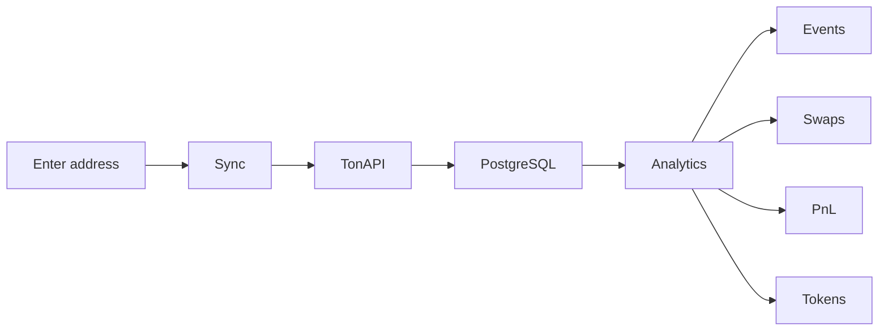

# TON Wallet Analytics — Project Overview

> This document describes the product purpose, problems solved, target audience, displayed data, and current implementation in the `ton-wallets` repository.

**Languages:** [Русский](./project-overview.md) · English

---

## Summary

**TON Wallet Analytics** is a web service for analyzing TON wallets. The user enters an address; the service syncs on-chain history via **TonAPI**, stores normalized events in **PostgreSQL**, and builds analytics: transaction history, swaps, PnL for TON/USDT and jettons, and current balances.

**One-liner pitch:**

> A personal analytics dashboard for a TON wallet: instead of a raw block explorer — a ready-made view of income, expenses, swaps, and profit per asset.

---

## Problem and User Pain Points

| Pain | How it's usually solved today | What the product provides |
|------|-------------------------------|---------------------------|
| Explorers show raw events, not financial outcomes | Manual review in Tonviewer/Tonscan | Aggregated PnL and cashflow |
| Swaps are mixed with transfers in the feed | Excel, notes, third-party trackers | Auto swap detection + dedicated section |
| Many jettons and DEXes — hard to calculate totals | Manual spreadsheets | Per-token PnL line by line |
| Unclear where TON went outside trading | Clicking through every transaction | Pure TON transfers separated from swaps |
| Unclear which protocols the wallet interacted with | Memorizing contract addresses | Swap breakdown by DEX + address labels |
| No single dashboard per address | Multiple tools | One URL: balance + history + analytics |

---

## Target Audience

1. **Active TON DEX traders** (Ston.fi, DeDust, etc.) — want trade outcomes, not just a transaction list.
2. **Jetton holders** — care about PnL per asset, not only current balance.
3. **Cashflow-focused users** — how much TON/USDT flowed in and out (swaps + pure transfers).
4. **On-chain analysts and researchers** — quick review of any wallet by address without connecting a wallet.
5. **Power users** — optional auth via TON Connect / OAuth for a personal profile.

---

## Value Proposition

Instead of manually going through hundreds of transactions in a block explorer, the user gets a **ready-made financial picture of the wallet**:

- where TON and jettons went;
- how much was earned or lost on swaps;
- net flow for TON and USDT;
- which DEXes and counterparties the wallet interacted with.

Data is built on synchronized and enriched on-chain history, not one-off API calls.

---

## Primary User Flow



1. User opens `/wallets` or enters an address in the analyze form.
2. Clicks **Sync** (or lands with `?sync=1`) — triggers `POST /api/sync`.
3. The service fetches events from TonAPI, transforms them into actions (`ChainAction`), enriches addresses and jettons.
4. UI shows summary and tabs: **Events**, **Swaps**, **PnL**, **Tokens**.

---

## Displayed Data

### Wallet Summary (sidebar / mobile card)

| Metric | Description |
|--------|-------------|
| Address | Full TON address, copy to clipboard |
| Sync status | IDLE / SYNCING / COMPLETED / ERROR |
| TON balance | Live on-chain balance (TonAPI) |
| Balance (swap net TON) | Net TON from swaps: received − spent |
| Tokens (tracked) | Jettons that participated in swaps |
| Swaps | Count of recognized swaps |
| Events / Actions | Event and action counters in DB |

### Events Tab — Transaction History

Human-readable on-chain activity feed with pagination and filters.

**Operation types:**

- TON transfer — Received / Sent TON
- Jetton transfer — incoming/outgoing jettons
- Swap tokens — `JETTON_SWAP` and `INFERRED_SWAP`
- Stake deposit / withdraw
- Contract call and other types from `ChainActionType`

**Filters:**

- action type;
- direction (incoming / outgoing);
- status (success / failed / pending);
- date range.

**Per operation:**

- time (grouped: Today / Yesterday / date);
- amount and asset symbol;
- counterparty (address + **name** from `ChainAddress` registry when available);
- link to Tonviewer;
- raw transaction details.

### Swaps Tab — Swap Analytics

| Block | Content |
|-------|---------|
| Aggregate | Swap count, TON spent / received / net |
| By DEX | Breakdown by protocol (Ston.fi, DeDust, etc. from metadata) |
| By leg type | TON → Jetton, Jetton → TON, Jetton ↔ Jetton, TON ↔ TON |
| By jetton | Spent / received, TON in/out, counterpart tokens |
| Swap list | Recent trades with DEX label and links |
| Unclassified | Clusters not recognized as swaps (for further labeling) |

**Swap recognition:**

- **Native** — `JETTON_SWAP` actions from TonAPI;
- **Inferred** — heuristic parsing of transaction chains (`swap-inference.utils`);
- **Lending filter** — lending deposits/withdrawals are not counted as DEX swaps.

### PnL Tab — Profit and Loss

| Section | Description |
|---------|-------------|
| PnL TON (incl. pTON) | Swaps + pure TON transfers; total PnL includes withdrawn TON |
| PnL USDT | jUSDT / USD₮ in USD only, not mixed with TON |
| Your Assets | Per-jetton PnL lines across the portfolio |
| Pure TON transfers | Deposits and withdrawals without swaps or contracts |

**Flow metrics:** spent, received, net (in TON or USD depending on asset).

Materialized data is stored in `ChainWalletPnl` and recomputed on sync.

### Tokens Tab — Current Balances

- TON balance (live from TonAPI);
- jetton list: symbol, name, amount, icon;
- overlap with "tracked" jettons from swap history.

---

## Protocols and Labeled Addresses

The product does not require separate manual labeling for the basic flow — data is enriched during sync:

| Source | Provides |
|--------|----------|
| `ChainAddress.name` | Counterparty names from TonAPI (contracts, wallets, pools) |
| `swap.dex` / metadata | DEX protocol from swap metadata |
| `ChainJetton` | Symbol, name, decimals, verification, prices |
| Lending markers | Separates lending operations from DEX swaps |

**Roadmap:** a dedicated "all wallet protocols" aggregate (DEX + staking + lending) built from collected data.

---

## Tech Stack

| Layer | Technology |
|-------|------------|
| Frontend | Next.js 16 (App Router), React, TypeScript |
| UI | Tailwind CSS, shadcn/ui |
| Data fetching (client) | TanStack Query |
| Backend | Next.js API Routes |
| ORM | Prisma 7 + `@prisma/adapter-pg` |
| Database | PostgreSQL |
| Blockchain API | TonAPI (`@random1ze/ton-api-client`) |
| Auth | Auth.js, TON Connect (ton_proof), JWT 15m + refresh cookie, OAuth (GitHub/Google) optional |
| Package manager | pnpm |

---

## Module Architecture

Domain-driven Clean Architecture:

```
src/
├── app/                    # Next.js routes, API handlers
├── modules/
│   ├── wallet/             # Sync, events, history, balances
│   ├── swap/               # Swap detection, stats, swap PnL
│   ├── jetton/             # Portfolio PnL, TON transfers, formatting
│   └── auth/               # TON Connect, sessions, profile
└── shared/
    ├── config/             # env, auth config
    ├── infrastructure/     # prisma, tonapi, api client
    └── lib/                # utilities (addresses, amounts, routing)
```

**Import direction:** presentation → application → domain; infrastructure only from application/api.

---

## Data Model (Key Entities)

| Model | Purpose |
|-------|---------|
| `ChainEvent` | Wallet event from TonAPI (timestamp, lt, raw_data) |
| `ChainAction` | Normalized action within an event (transfer, swap, stake…) |
| `ChainAddress` | Address registry with name, scam flag, icon |
| `ChainJetton` | Jetton registry with metadata and prices |
| `ChainSyncState` | Wallet sync state (cursor, status, counters) |
| `ChainWalletPnl` | Materialized PnL per asset (TON, USDT, jetton) |
| `ChainRawEvent` | Raw TonAPI payload before processing |

**Action types (`ChainActionType`):**  
`TON_TRANSFER`, `JETTON_TRANSFER`, `JETTON_SWAP`, `INFERRED_SWAP`, `DEPOSIT_STAKE`, `WITHDRAW_STAKE`, `SMART_CONTRACT_EXEC`, NFT operations, and more.

---

## API Endpoints

| Method | Path | Purpose |
|--------|------|---------|
| `POST` | `/api/sync` | Sync wallet with TonAPI |
| `GET` | `/api/wallets/[address]/summary` | Summary: sync state, stats, swapStats |
| `GET` | `/api/wallets/[address]/events` | History page with filters |
| `GET` | `/api/wallets/[address]/balances` | On-chain TON + jetton balances |
| `GET` | `/api/wallets` | Wallet list |
| `GET` | `/api/jettons/rates` | Jetton rates |
| `GET` | `/api/health` | Health check |
| Auth | `/api/auth/*` | Auth.js, refresh, ton-proof payload |

---

## UI Routes

| Path | Page |
|------|------|
| `/` | Redirect to default wallet |
| `/wallets` | List / address analyze form |
| `/wallets/[address]` | Main wallet dashboard (tabs via `?tab=`) |
| `/wallets/[address]?sync=1` | Auto-start sync |
| `/sign-in` | Sign in (OAuth / TON Connect) |
| `/profile` | User profile |

**Wallet tabs:** `events` | `swaps` | `pnl` | `tokens` (query param `tab`).

---

## Sync Pipeline

1. **Fetch** — paginate TonAPI events (`before_lt` until full history).
2. **Transform** — `transformer.ts` parses `AccountEvent` into `ChainAction[]`.
3. **Enrich** — upsert addresses (`ChainAddress`) and jettons (`ChainJetton`) with names from API.
4. **Infer swaps** — heuristics for unlabeled TonAPI swaps.
5. **PnL recompute** — recalculate `ChainWalletPnl`, TON transfer PnL, portfolio lines.
6. **Sync state** — update cursor (`lastLt`, `lastTonEventId`, `historyComplete`).

Statuses: `IDLE` → `SYNCING` → `COMPLETED` / `ERROR` / `PAUSED`.

---

## Authentication

- **TON Connect** — `ton_proof` signature, wallet linked to account.
- **OAuth** — GitHub / Google (optional, via env).
- **JWT** — 15 min access + rotating refresh cookie (httpOnly).
- **Admins** — `AUTH_ADMIN_EMAILS` / `AUTH_ADMIN_WALLETS`.

Wallet analysis by address works without auth; auth is for personal flows and profile.

---

## Environment Variables (Required)

| Variable | Purpose |
|----------|---------|
| `DATABASE_URL` | PostgreSQL connection string |
| `NEXT_PUBLIC_TONAPI_BASE_URL` | TonAPI base URL (client + server) |
| `TONAPI_API_KEY` | API key (server only) |
| `AUTH_SECRET` | Auth.js secret (required in production) |

Optional: `AUTH_GITHUB_*`, `AUTH_GOOGLE_*`, `AUTH_ADMIN_EMAILS`, `AUTH_ADMIN_WALLETS`.

---

## Local Development

```bash
pnpm install
pnpm prisma:generate
pnpm prisma:deploy   # apply migrations
pnpm dev             # http://localhost:3000
```

**API smoke check** (default address):

```bash
curl -sS "http://localhost:3000/api/wallets/EQD_VOCkZZxBqRlHgqVXzKpoW_29kR-S0t02VN4VxiDTr7Bl/summary"
curl -sS "http://localhost:3000/api/wallets/EQD_VOCkZZxBqRlHgqVXzKpoW_29kR-S0t02VN4VxiDTr7Bl/events?limit=2"
```

---

## Current Status and Roadmap

### Shipped

- [x] Wallet history sync with TonAPI
- [x] Event normalization into actions
- [x] History with filters and pagination
- [x] Swap detection (native + inferred)
- [x] PnL for TON, USDT, jetton portfolio
- [x] Pure TON transfers separated from swaps
- [x] Swap breakdown by DEX and jetton
- [x] On-chain TON + jetton balances
- [x] Address names from TonAPI
- [x] Mobile-responsive UI
- [x] TON Connect auth

### In Progress / Planned

- [ ] Address QR code (button exists, disabled)
- [ ] "All wallet protocols" aggregate (single tab)
- [ ] Data export (CSV / tax report)
- [ ] Multi-wallet aggregation
- [ ] Better classification of unclassified swap clusters

---

## Presentation Copy

### Elevator pitch (30 sec)

> TON wallet analytics. Enter an address — the service syncs full on-chain history, separates swaps from transfers, and shows real PnL for TON, USDT, and jettons. See DEX profits, where TON went, and which protocols you used — without manual explorer work.

### For end users

> Enter your address — see not just transactions, but how much you're actually up or down per token and on TON overall.

### For partners / investors

> A personal on-chain analytics layer for TON: normalized events + swap inference + PnL engine on top of TonAPI. Focus: retail traders and power users who need more than block explorers for decisions and reporting.

---

## Related Documents

- `AGENTS.md` — Cloud/dev environment instructions
- `.cursor/rules/next.mdc` — Next.js project conventions
- `prisma/schema.prisma` — full database schema
- [Project overview (RU)](./project-overview.md)

---

*Last updated: June 2025*
