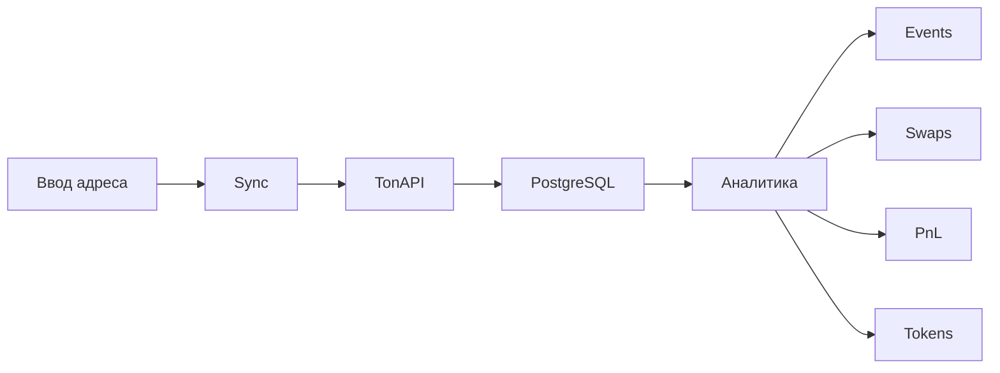

# TON Wallet Analytics — описание проекта

> Документ описывает назначение продукта, решаемые проблемы, целевую аудиторию, отображаемые данные и текущую реализацию в репозитории `ton-wallets`.

**Языки:** Русский · [English](./project-overview.en.md)

---

## Краткое описание

**TON Wallet Analytics** — веб-сервис для анализа TON-кошельков. Пользователь вводит адрес, сервис синхронизирует on-chain историю через **TonAPI**, сохраняет нормализованные события в **PostgreSQL** и строит аналитику: историю операций, свапы, PnL по TON/USDT и жетонам, текущие балансы.

**Одна строка для питча:**

> Персональный аналитический кабинет для TON-кошелька: вместо сырого эксплорера — готовая картина доходов, расходов, свапов и прибыли по каждому активу.

---

## Проблема и боли пользователя

| Боль | Как обычно решают сейчас | Что даёт продукт |
|------|--------------------------|------------------|
| Эксплореры показывают сырые события, а не финансовый результат | Ручной разбор в Tonviewer/Tonscan | Агрегированный PnL и cashflow |
| Свапы смешиваются с переводами в ленте | Excel, заметки, сторонние трекеры | Авто-детект свапов + отдельный раздел |
| Много жетонов и DEX — сложно посчитать итог | Таблицы вручную | PnL построчно по каждому токену |
| Непонятно, куда ушли TON вне торговли | Просмотр каждой транзакции | Чистые TON-переводы отдельно от свапов |
| Неясно, с какими протоколами взаимодействовал кошелёк | Знание адресов контрактов | Разбивка свапов по DEX + имена адресов |
| Нет единого дашборда по одному адресу | Несколько инструментов | Один URL: баланс + история + аналитика |

---

## Целевая аудитория

1. **Активные трейдеры на TON DEX** (Ston.fi, DeDust и др.) — хотят видеть результат сделок, а не только список транзакций.
2. **Холдеры жетонов** — интересует PnL по каждому активу, а не только текущий баланс.
3. **Пользователи, которым важен cashflow** — сколько TON/USDT вошло и вышло (свапы + чистые переводы).
4. **Ончейн-аналитики и исследователи** — быстрый разбор любого кошелька по адресу без подключения кошелька.
5. **Power users** — опциональная авторизация через TON Connect / OAuth для персонального профиля.

---

## Ценностное предложение

Вместо ручного прохода по сотням транзакций в блокчейн-эксплорере пользователь получает **готовую финансовую картину кошелька**:

- куда уходили TON и жетоны;
- сколько заработано или потеряно на свапах;
- чистый поток по TON и USDT;
- с какими DEX и контрагентами взаимодействовал кошелёк.

Данные строятся на синхронизированной и размеченной on-chain истории, а не на разовых запросах к API.

---

## Основной пользовательский сценарий



1. Пользователь открывает `/wallets` или вводит адрес в форме анализа.
2. Нажимает **Sync** (или переходит с `?sync=1`) — запускается `POST /api/sync`.
3. Сервис подтягивает события из TonAPI, трансформирует их в действия (`ChainAction`), обогащает адреса и жетоны.
4. UI показывает сводку и вкладки: **Events**, **Swaps**, **PnL**, **Tokens**.

---

## Отображаемые данные

### Сводка кошелька (sidebar / mobile card)

| Метрика | Описание |
|---------|----------|
| Адрес | Полный TON-адрес, копирование в буфер |
| Статус синхронизации | IDLE / SYNCING / COMPLETED / ERROR |
| Баланс TON | Актуальный on-chain баланс (TonAPI) |
| Balance (swap net TON) | Чистый TON по свапам: received − spent |
| Tokens (tracked) | Количество жетонов, участвовавших в свапах |
| Swaps | Количество распознанных свапов |
| Events / Actions | Счётчики событий и действий в БД |

### Вкладка Events — история операций

Человекочитаемая лента on-chain активности с пагинацией и фильтрами.

**Типы операций:**

- TON transfer — Received / Sent TON
- Jetton transfer — входящие/исходящие жетоны
- Swap tokens — `JETTON_SWAP` и `INFERRED_SWAP`
- Stake deposit / withdraw
- Contract call и другие типы из `ChainActionType`

**Фильтры:**

- тип действия (action type);
- направление (incoming / outgoing);
- статус (success / failed / pending);
- диапазон дат.

**Для каждой операции:**

- время (группировка: Today / Yesterday / дата);
- сумма и символ актива;
- контрагент (адрес + **имя** из справочника `ChainAddress`, если есть);
- ссылка на Tonviewer;
- сырые детали транзакции (raw details).

### Вкладка Swaps — аналитика свапов

| Блок | Содержание |
|------|------------|
| Агрегат | Количество свапов, TON spent / received / net |
| По DEX | Разбивка по протоколам (Ston.fi, DeDust и др. из metadata) |
| По типу ног | TON → Jetton, Jetton → TON, Jetton ↔ Jetton, TON ↔ TON |
| По жетонам | Потрачено / получено, TON in/out, counterpart-токены |
| Список свапов | Последние сделки с DEX-меткой и ссылками |
| Unclassified | Кластеры, не распознанные как свап (для доразметки) |

**Распознавание свапов:**

- **Native** — действия типа `JETTON_SWAP` из TonAPI;
- **Inferred** — эвристический разбор цепочек транзакций (`swap-inference.utils`);
- **Lending filter** — депозиты/выводы в lending-протоколах не считаются DEX-свапами.

### Вкладка PnL — прибыль и убытки

| Секция | Описание |
|--------|----------|
| PnL TON (incl. pTON) | Свапы + чистые TON-переводы; total PnL включает withdrawn TON |
| PnL USDT | jUSDT / USD₮ только в USD, не смешивается с TON |
| Your Assets | Построчный PnL по каждому жетону в портфеле |
| Pure TON transfers | Депозиты и выводы без свапов и контрактов |

**Метрики по потокам:** spent, received, net (в TON или USD в зависимости от актива).

Материализованные данные хранятся в `ChainWalletPnl` и пересчитываются при синке.

### Вкладка Tokens — текущие балансы

- TON balance (live с TonAPI);
- список жетонов: символ, название, количество, иконка;
- пересечение с «tracked» жетонами из истории свапов.

---

## Протоколы и размеченные адреса

Продукт не требует отдельной ручной разметки для базового сценария — данные обогащаются при синке:

| Источник | Что даёт |
|----------|----------|
| `ChainAddress.name` | Имена контрагентов из TonAPI (контракты, кошельки, пулы) |
| `swap.dex` / metadata | DEX-протокол из метаданных свапа |
| `ChainJetton` | Символ, название, decimals, verification, цены |
| Lending markers | Отделение lending-операций от DEX-свапов |

**Roadmap:** отдельный агрегат «все протоколы кошелька» (DEX + staking + lending) на основе уже собранных данных.

---

## Технический стек

| Слой | Технология |
|------|------------|
| Frontend | Next.js 16 (App Router), React, TypeScript |
| UI | Tailwind CSS, shadcn/ui |
| Data fetching (client) | TanStack Query |
| Backend | Next.js API Routes |
| ORM | Prisma 7 + `@prisma/adapter-pg` |
| БД | PostgreSQL |
| Blockchain API | TonAPI (`@random1ze/ton-api-client`) |
| Auth | Auth.js, TON Connect (ton_proof), JWT 15m + refresh cookie, OAuth (GitHub/Google) опционально |
| Package manager | pnpm |

---

## Архитектура модулей

Clean Architecture по доменам:

```
src/
├── app/                    # Next.js routes, API handlers
├── modules/
│   ├── wallet/             # Синк, события, история, балансы
│   ├── swap/               # Детект свапов, статистика, PnL по свапам
│   ├── jetton/             # Портфельный PnL, TON transfers, форматирование
│   └── auth/               # TON Connect, сессии, профиль
└── shared/
    ├── config/             # env, auth config
    ├── infrastructure/     # prisma, tonapi, api client
    └── lib/                # утилиты (адреса, суммы, роутинг)
```

**Направление импортов:** presentation → application → domain; infrastructure только из application/api.

---

## Модель данных (ключевые сущности)

| Модель | Назначение |
|--------|------------|
| `ChainEvent` | Событие кошелька из TonAPI (timestamp, lt, raw_data) |
| `ChainAction` | Нормализованное действие внутри события (transfer, swap, stake…) |
| `ChainAddress` | Справочник адресов с именем, scam-флагом, иконкой |
| `ChainJetton` | Справочник жетонов с метаданными и ценами |
| `ChainSyncState` | Состояние синхронизации кошелька (cursor, status, counters) |
| `ChainWalletPnl` | Материализованный PnL по активам (TON, USDT, jetton) |
| `ChainRawEvent` | Сырой payload TonAPI до обработки |

**Типы действий (`ChainActionType`):**  
`TON_TRANSFER`, `JETTON_TRANSFER`, `JETTON_SWAP`, `INFERRED_SWAP`, `DEPOSIT_STAKE`, `WITHDRAW_STAKE`, `SMART_CONTRACT_EXEC`, NFT-операции и др.

---

## API endpoints

| Метод | Путь | Назначение |
|-------|------|------------|
| `POST` | `/api/sync` | Синхронизация кошелька с TonAPI |
| `GET` | `/api/wallets/[address]/summary` | Сводка: sync state, stats, swapStats |
| `GET` | `/api/wallets/[address]/events` | Страница истории с фильтрами |
| `GET` | `/api/wallets/[address]/balances` | On-chain балансы TON + jettons |
| `GET` | `/api/wallets` | Список кошельков |
| `GET` | `/api/jettons/rates` | Курсы жетонов |
| `GET` | `/api/health` | Health check |
| Auth | `/api/auth/*` | Auth.js, refresh, ton-proof payload |

---

## Маршруты UI

| Путь | Страница |
|------|----------|
| `/` | Редирект на дефолтный кошелёк |
| `/wallets` | Список / форма анализа адреса |
| `/wallets/[address]` | Основной дашборд кошелька (вкладки через `?tab=`) |
| `/wallets/[address]?sync=1` | Автозапуск синхронизации |
| `/sign-in` | Вход (OAuth / TON Connect) |
| `/profile` | Профиль пользователя |

**Вкладки кошелька:** `events` | `swaps` | `pnl` | `tokens` (query param `tab`).

---

## Пайплайн синхронизации

1. **Fetch** — пагинация событий TonAPI (`before_lt` до полной истории).
2. **Transform** — `transformer.ts` разбирает `AccountEvent` в `ChainAction[]`.
3. **Enrich** — upsert адресов (`ChainAddress`) и жетонов (`ChainJetton`) с именами из API.
4. **Infer swaps** — эвристики для неразмеченных TonAPI-свапов.
5. **PnL recompute** — пересчёт `ChainWalletPnl`, TON transfer PnL, портфельных линий.
6. **Sync state** — обновление курсора (`lastLt`, `lastTonEventId`, `historyComplete`).

Статусы: `IDLE` → `SYNCING` → `COMPLETED` / `ERROR` / `PAUSED`.

---

## Аутентификация

- **TON Connect** — подпись `ton_proof`, привязка кошелька к аккаунту.
- **OAuth** — GitHub / Google (опционально, через env).
- **JWT** — access 15 мин + rotating refresh cookie (httpOnly).
- **Админы** — `AUTH_ADMIN_EMAILS` / `AUTH_ADMIN_WALLETS`.

Анализ кошелька по адресу доступен без авторизации; auth нужен для персональных сценариев и профиля.

---

## Переменные окружения (обязательные)

| Переменная | Назначение |
|------------|------------|
| `DATABASE_URL` | PostgreSQL connection string |
| `NEXT_PUBLIC_TONAPI_BASE_URL` | TonAPI base URL (client + server) |
| `TONAPI_API_KEY` | API key (только server) |
| `AUTH_SECRET` | Auth.js secret (обязателен в production) |

Опционально: `AUTH_GITHUB_*`, `AUTH_GOOGLE_*`, `AUTH_ADMIN_EMAILS`, `AUTH_ADMIN_WALLETS`.

---

## Локальная разработка

```bash
pnpm install
pnpm prisma:generate
pnpm prisma:deploy   # применить миграции
pnpm dev             # http://localhost:3000
```

**Smoke-check API** (дефолтный адрес):

```bash
curl -sS "http://localhost:3000/api/wallets/EQD_VOCkZZxBqRlHgqVXzKpoW_29kR-S0t02VN4VxiDTr7Bl/summary"
curl -sS "http://localhost:3000/api/wallets/EQD_VOCkZZxBqRlHgqVXzKpoW_29kR-S0t02VN4VxiDTr7Bl/events?limit=2"
```

---

## Текущий статус и roadmap

### Реализовано

- [x] Синхронизация истории кошелька с TonAPI
- [x] Нормализация событий в actions
- [x] История с фильтрами и пагинацией
- [x] Детект свапов (native + inferred)
- [x] PnL по TON, USDT, портфелю жетонов
- [x] Чистые TON-переводы отдельно от свапов
- [x] Разбивка свапов по DEX и жетонам
- [x] On-chain балансы TON + jettons
- [x] Имена адресов из TonAPI
- [x] Mobile-responsive UI
- [x] TON Connect auth

### В разработке / планируется

- [ ] QR-код адреса (кнопка есть, disabled)
- [ ] Агрегат «все протоколы кошелька» (единая вкладка)
- [ ] Экспорт данных (CSV / tax report)
- [ ] Агрегация по нескольким кошелькам
- [ ] Улучшение классификации unclassified swap clusters
- [ ] Обмен жетонов на странице
- [ ] Анализ стейкинга, лендинга и другой дефи активности кошелька

---

## Формулировки для презентации

### Elevator pitch (30 сек)

> Это аналитика TON-кошелька. Вбиваешь адрес — сервис синхронизирует всю историю с блокчейна, отделяет свапы от переводов и показывает реальный PnL по TON, USDT и жетонам. Видно, сколько заработал на DEX, куда уходили TON и с какими протоколами ты взаимодействовал — без ручного разбора в эксплорере.

### Для пользователя

> Подключи адрес — увидишь не просто транзакции, а сколько ты реально в плюсе или минусе по каждому токену и по TON в целом.

### Для партнёра / инвестора

> Персональный on-chain analytics layer для TON: нормализованные события + swap inference + PnL-движок поверх TonAPI. Фокус — retail-трейдеры и power users, которым блокчейн-эксплореров недостаточно для принятия решений и отчётности.

---

## Связанные документы

- [Project overview (EN)](./project-overview.en.md)
- `AGENTS.md` — инструкции для Cloud/dev окружения
- `.cursor/rules/next.mdc` — конвенции Next.js-проекта
- `prisma/schema.prisma` — полная схема БД

---

*Последнее обновление: июнь 2025*
